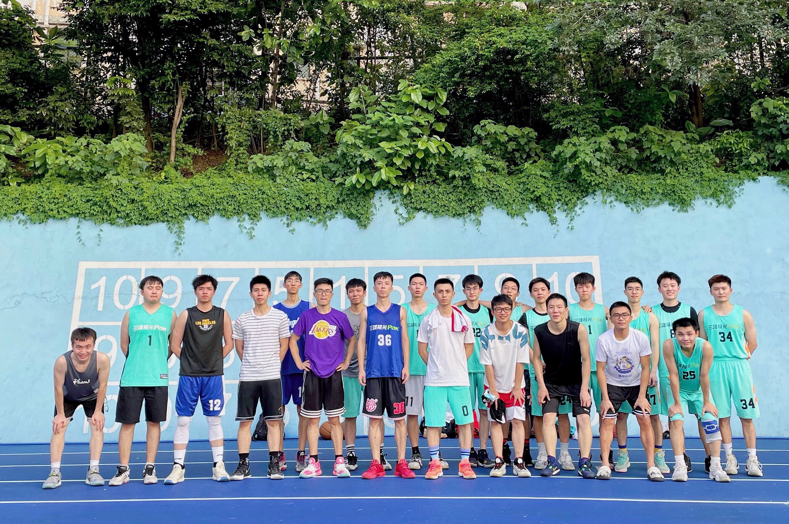

<h4 style="text-align: left;">Memories</h4>

<!-- 

  <ul class="memories-list personal-memories">
    <li>Personal Title of Personal Memory 1 (Month Year)</li>
    <li>Personal Title of Personal Memory 2 (Month Year)</li>
  </ul>

<h4 style="text-align: left;">Travel Memories</h4>

  <ul class="memories-list travel-memories">
    <li>Travel Title of Travel Memory 1 (Month Year)</li>
    <li>Travel Title of Travel Memory 2 (Month Year)</li>
  </ul>

<h4 style="text-align: left;">Academic Memories</h4>

  <ul class="memories-list academic-memories">
    <li>Academic Title of Academic Memory 1 (Month Year)</li>
    <li>Academic Title of Academic Memory 2 (Month Year)</li>
  </ul>

 --> 

<h4 style="text-align: left;">Hobbies</h4>

  <h5 style="text-align: left;">Basketball</h5>
  

    While I love many sports, basketball has been my greatest passion since elementary school. Unfortunately, at age 13, I was diagnosed with scoliosis. My doctor told me that I might never be able to engage in  basketball again. But I refused to accept this fate. Every morning, I would wake up early to run, strengthen my back through pull-ups and specific rehabilitation routines. By high school, my become one of the strongest athletes in my class!
  

  
  

    As an avid NBA fan, my first jersey was Ming Yao's Houston Rockets uniform. During high school, I would purchase <i>Slam Dunk</i> magazine every week. I still remember the shock of watching the Allen Iverson highlight reel for the first time - such a relatively small figure fighting fearlessly like a matador amongst giants. Moreover, Kobe's “Mamba Mentality” has deeply influenced my way of dealing with challenges. However, LeBron James has probably had the most profound impact on me. During my free time, I would watch every game LeBron played and learn his leadership and resilience.
  

  
  

   I was fortunate enough to live in Wisconsin, where Chinese basketball star Jianlian Yi played for the Milwaukee Bucks. I still remember the day he was selected by Milwaukee, when I was still in seventh grade. Giannis Antetokounmpo's journey has resonated deeply with me—watching him evolve from a skinny kid from Athens into an NBA champion embodied a powerful lesson. As he famously said, "Talent won't give you carved muscles!"
  

  
  

    I've been injured many times in my basketball journey. The most severe setback occurred in early 2024 when I suffered a lower back injury requiring surgery. I was essentially immobile, confined to bed rest. Yet these challenges never diminished my passion for the game. As Iverson famously said, "What doesn't kill you makes you stronger."
  

  
  

    Basketball has not only strengthened my body but also taught me invaluable life lessons about teamwork, perseverance, and rising after every fall.
  

  
  <!-- Row 1 -->
  

    

      
      

        2023 Basketball Personal
      

    

    

      
      

        2021 Basketball Team Photo
      

    

    

      
      

        2021 Basketball Team Photo
      

    

  

  
  <!-- Row 2 -->
  

    

      
      

        2020 Basketball Team Photo
      

    

    

      

        <video controls style="width: 100%; height: 200px; object-fit: cover;">
          <source src="../assets/personal/basketball/2019-basketball-team-highlights.mp4" type="video/mp4">
          Your browser does not support the video tag.
        </video>
      

      

        2019 Basketball Team Highlights
      

    

    

      
      

        2019 Basketball Team Photo
      

    

  

  
  <!-- Row 3 -->
  

    

      
      

        2018 Basketball Team Photo
      

    

    

      
      

        2018 Basketball Team Photo
      

    

    

      
      

        2017 Basketball Team Photo
      

    

  

  
  <!-- Row 4 -->
  

    

      
      

        2017 Basketball Team Photo
      

    

    

      
      

        2016 Basketball Team Photo
      

    

    

      
      

        2016 Basketball Team Photo
      

    

  

  
  <!-- Row 5 -->
  

    

      

        <video controls style="width: 100%; height: 200px; object-fit: cover;">
          <source src="../assets/personal/basketball/2015-baksetball-team-highlights.mp4" type="video/mp4">
          Your browser does not support the video tag.
        </video>
      

      

        2015 Basketball Team Highlights
      

    

    

      
      

        2015 Basketball Team Photo
      

    

    

      
      

        2014 Basketball Team Photo
      

    

  

