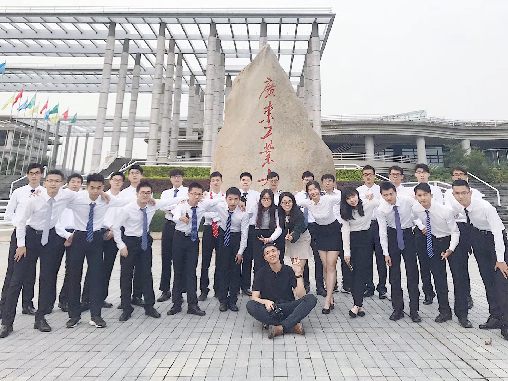

<h4 style="text-align: left;">Memories</h4>

<h4 style="text-align: left;">Entrepreneurship</h4>

  Growing up in Shenzhen, China, I witnessed the city's remarkable transformation from a small fishing village into a global technology hub - what many call the "Shenzhen speed." This environment planted the seeds of entrepreneurial spirit in me from an early age. During high school, I ventured into selling phone cards, coordinating food delivery services for school, setting up market stalls, selling courses, and organizing the campus laundry market. These experiences laid the foundation for my understanding of business models. 

  

  
  During my university years, I founded two technology companies, attempting to translate my scientific discoveries into practical innovations. Throughout this journey, I had the opportunity to connect with industry professionals. More fortunately, my companies attracted millions of potential investment from prominent institutions such as Yueke Securities and CITIC Securities. This greatly encouraged me to pursue innovation further. I've always adhered to one principle: "When scientific discoveries transcend the boundaries of the laboratory, they can truly make a meaningful impact on the world."

<!-- Entrepreneurship images -->

  

    
    

      2021 Qinglan Project
    

  

  

    
    

      2021 Qinglan Project
    

  

  

    
    

      2020 Winning Guangdong Competition
    

  

  

    
    

      2020 Winning Guangdong Competition
    

  

  

    
    

      2020 Chuangke Guangdong Competition
    

  

  

    
    

      2020 Chuangke Guangdong Competition
    

  

<h4 style="text-align: left;">Hobbies</h4>

  <h5 style="text-align: left;">Chef</h5>
  

    Cooking has become one of my greatest passions in recent years. I specialize in Cantonese cuisine, particularly in making soups, pan-frying steaks, and preparing salmon. Honestly, I didn't know how to cook before coming to the USA. But gradually, I discovered the joy of cooking. It helps me relax and unwind after intense research work, providing a balance to the mental demands of academic life. Now, Cooking has become a way for me to understand different cultures through their cuisines. I believe that good food has the power to bring people together and create lasting memories.
  

  <!-- Row 1 -->
  

    

      
      

        2025 Chef Huang (黄小厨)
      

    

    

      
      

        ‌Chicken Clay Pot‌ (啫啫鸡煲)
      

    

    

      
      

        Seafood Tofu Clay Pot (海鲜豆腐煲)
      

    

  

  
  <!-- Row 2 -->
  

    

      
      

        Beef Clay Pot (牛肉煲)
      

    

    

      
      

        Fish-Fragrant Eggplant Clay Pot (鱼香茄子煲)
      

    

    

      
      

        Beef Brisket Clay Pot (牛腩煲)
      

    

  

  <h5 style="text-align: left;">Basketball</h5>
  

    While I love many sports, basketball has been my greatest passion since elementary school. As an avid NBA fan, my first jersey was Ming Yao's Houston Rockets uniform. During high school, I would purchase <i>Slam Dunk</i> magazine every week. I still remember the shock of watching the Allen Iverson highlight reel for the first time - such a relatively small figure fighting fearlessly like a matador amongst giants. Moreover, Kobe's "Mamba Mentality" has deeply influenced my way of dealing with challenges. However, LeBron James has probably had the most profound impact on me. During my free time, I would watch every game LeBron played and learn his leadership and resilience.
  

  
  

   I was fortunate enough to live in Wisconsin, where Chinese basketball star Jianlian Yi played for the Milwaukee Bucks. I remember how happy I was the day he was drafted by Milwaukee, when I was still in seventh grade. Giannis Antetokounmpo's journey has resonated deeply with me—watching him evolve from a skinny kid from Athens into an NBA champion embodied a powerful lesson. As he famously said, "Talent won't give you carved muscles!"
  

  
  

    I've been injured many times in my basketball journey, such as sprained ankles and scraped knees. The most severe setback occurred in early 2024 when I suffered a lower back injury requiring surgery. For the first two weeks, I was essentially immobile, confined to bed rest. However, these challenges never diminished my passion for the game. As Iverson famously said, "What doesn't kill you makes you stronger." Basketball has not only strengthened my body but also taught me invaluable life lessons about teamwork, perseverance, and rising after every fall.
  

  
  <!-- Row 1 -->
  

    

      
      

        2023 Bakke Gym, UW-Madison, US
      

    

    

      
      

        2021 Basketball Team Photo
      

    

    

      
      

        2020 Basketball Team Photo
      

    

  

  
  <!-- Row 2 -->
  

    

      
      

        2019 Basketball Team Photo
      

    

    

      

        <video controls style="width: 100%; height: 200px; object-fit: cover;">
          <source src="../assets/personal/basketball/2018-basketball-team-highlights.mp4" type="video/mp4">
          Your browser does not support the video tag.
        </video>
      

      

        2018 Basketball Team Highlights
      

    

    

      
      

        2018 Basketball Team Photo
      

    

  

  
  <!-- Row 3 -->
  

    

      
      

        2018 Basketball Team Photo
      

    

    

      
      

        2018 Basketball Team Photo
      

    

    

      
      

        2017 Basketball Team Photo
      

    

  

  
  <!-- Row 4 -->
  

    

      
      

        2017 Basketball Team Photo
      

    

    

      
      

        2016 Basketball Team Photo
      

    

    

      
      

        2016 Basketball Team Photo
      

    

  

  
  <!-- Row 5 -->
  

    

      

        <video controls style="width: 100%; height: 200px; object-fit: cover;">
          <source src="../assets/personal/basketball/2015-baksetball-team-highlights.mp4" type="video/mp4">
      Your browser does not support the video tag.
    </video>
      

      

        2015 Basketball Team Highlights
      

    

    

      
      

        2015 Basketball Team Photo
      

    

    

      
      

        2014 Basketball Team Photo
      

    

  

  <h5 style="text-align: left;">Photography</h5>
  

    I have a deep passion for photography, specializing in documentary and journalistic photography. My philosophy is: "A photograph is a witness to a moment in history." I served as the vice president of the photography association, and regularly contributed photos to the university's official website. I am a photographer for Visual China and a member of the Guangzhou Photography Association. I also have developed an interest in astrophotography and I am a member of the Astronomy Club. This is a collection of postcards I created from my photography work <a href="{{ '/photographic_works/postcards/' | relative_url }}">here</a>。
    
    
    
    
    
    My journey in photography began with a Nikon D700, followed by a Canon 70D, and later a Canon 6D. 
  

  
  

    During my university years, I co-founded a creative media studio with senior students, focusing on MG animation and micro-film production. Our studio's original character "Zuiyao B (最耀B)" garnered over 100 million views across platforms. You can find our works on <a href="https://www.youtube.com/playlist?list=PLnQTmrTdfHskys9PPoE_mWQStAVr59GtY" target="_blank">YouTube</a> and <a href="https://space.bilibili.com/26055201" target="_blank">Bilibili</a>. Additionally, my micro-film "Drinking Water and Remembering the Source (饮水思源)" won the "Best Film Silver Award" (RMB ¥40,000) <a href="{{ '/assets/personal/Photography/2016-movie-award.png' | relative_url }}" target="_blank">[Certificate]</a>. I'm particularly proud of my role as executive producer in the university commemorative graduation video <a href="https://v.qq.com/x/page/k0702zufnaj.html" target="_blank">"The Journey (走过)"</a>.
  

  
  <!-- Photography images -->
  

    

      
      

        2018 Astrophotography Activities
      

    

    

      
      

        2016 Photography Activities
      

    

    

      
      

        2014 The camera I own
      

    

  

