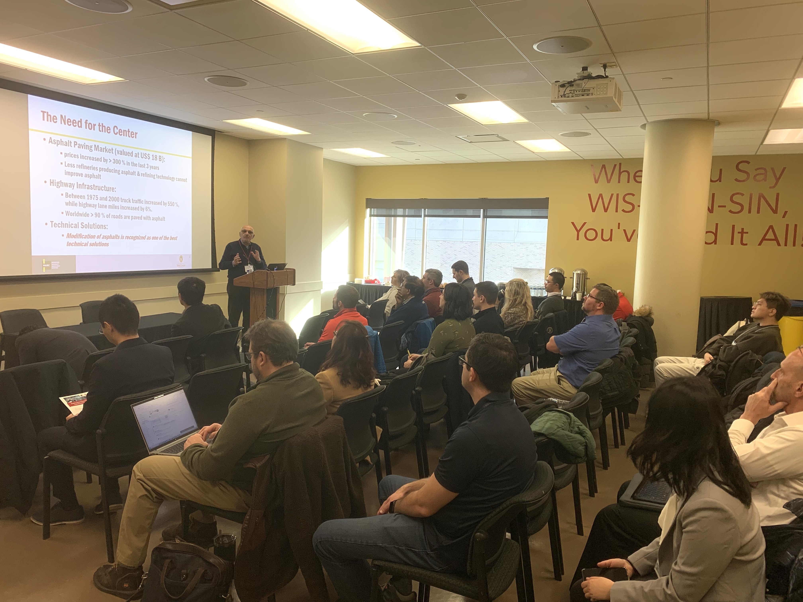
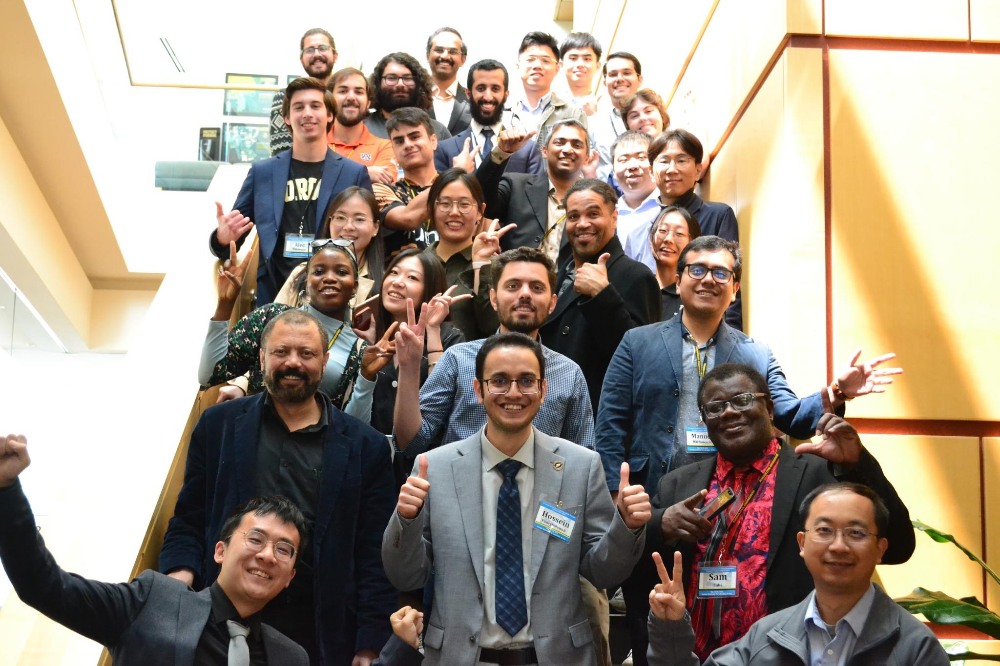

<h4 style="text-align: left;">Academic Services</h4>

  <h5 style="text-align: left;">Journal Reviewer</h5>
  <ul class="services-list academic-services">
    <li>IEEE Transactions on Intelligent Transportation Systems (TITS)</li>
    <li>IEEE Transactions on Circuits and Systems for Video Technology (TCSVT)</li>
    <li>IEEE Transactions on Cognitive and Developmental Systems (TCDS)</li>
    <li>IEEE Transactions on Intelligent Vehicles (TIV)</li>
    <li>Transportation Research Part C: Emerging Technologies (Part C)</li>
    <li>Computer-Aided Civil and Infrastructure Engineering (CACAIE)</li>
    <li>IEEE Transactions on Image Processing (TIP)</li>
    <li>IEEE Robotics and Automation Letters (RA-L)</li>
    <li>IEEE Intelligent Transportation Systems Magazine (ITSM)</li>
    <li>Journal of Advanced Transportation (JAT) <a href="{{ '/assets/services/2024_ATR_Reviewer_Certificate.pdf' | relative_url }}" target="_blank">[Certificate]</a></li>
    <li>Neural Computing and Applications (NCAA)</li>
    <li>IEEE Access</li>
    <li>Applied Intelligence</li>
    <li>Scientific Reports</li>
  </ul>

  <h5 style="text-align: left;">Conference Reviewer</h5>
  <ul class="services-list academic-services">
    <li>Transportation Research Board Annual Meeting (TRB)</li>
    <li>IEEE Intelligent Vehicles Symposium (IV)</li>
    <li>IEEE Intelligent Transportation Systems Conference (ITSC)</li>
  </ul>

  <h5 style="text-align: left;">Membership</h5>
  <ul class="services-list academic-services">
    <li>IEEE Student Member</li>
    <li>ASCE Student Member</li>
    <li>COTA Student Member</li>
  </ul>

<h4 style="text-align: left;">Community Services</h4>

  <h5 style="text-align: left;">Conference Organizer</h5>
  <ul class="services-list community-services">
    <li class="conference-item">Modified Asphalt Research Center (MARC) Future Research Focus Workshop, Madison, WI, USA, February 21, 2024 <a href="{{ '/assets/services/MARC/2024_MARC_1.jpg' | relative_url }}" target="_blank">[Flyer]</a>
      

        

          

            
            

              MARC Workshop
            

          

          

            
            

              MARC Workshop
            

          

        

      

    </li>
    <li class="conference-item">Session Chair, 3rd Annual Conference on Next-Generation Transport Systems (NGTS-3), West Lafayette, IN, USA, May 16-18, 2023 <a href="{{ '/assets/services/NGTS/2023_NGTS_Flyer.pdf' | relative_url }}" target="_blank">[Flyer]</a>
      

        

          

            
            

              NGTS-3 Conference
            

          

          

            
            

              NGTS-3 Conference
            

          

        

      

    </li>
  </ul>

 