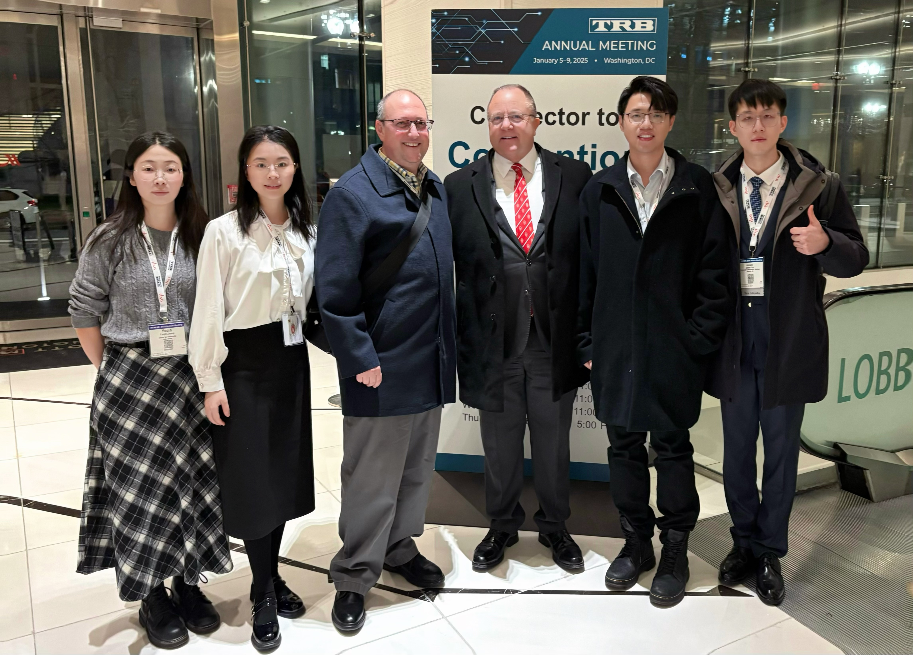
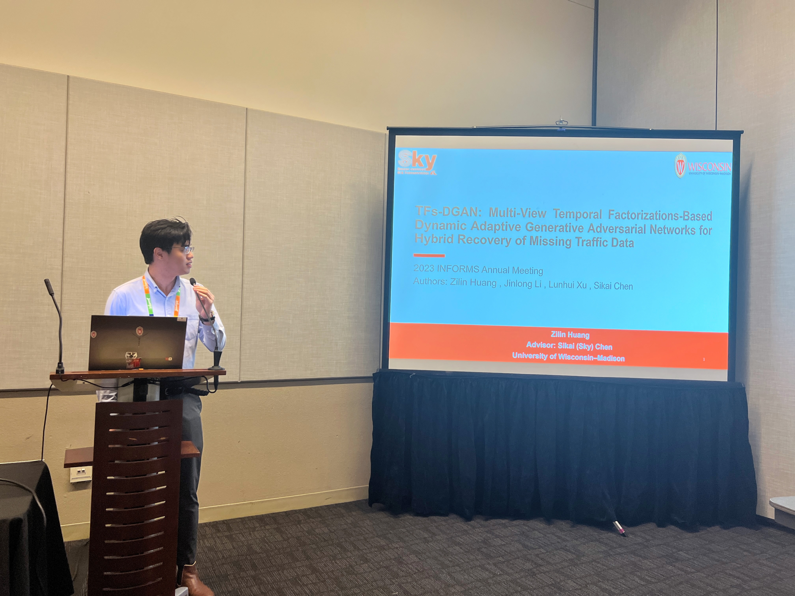
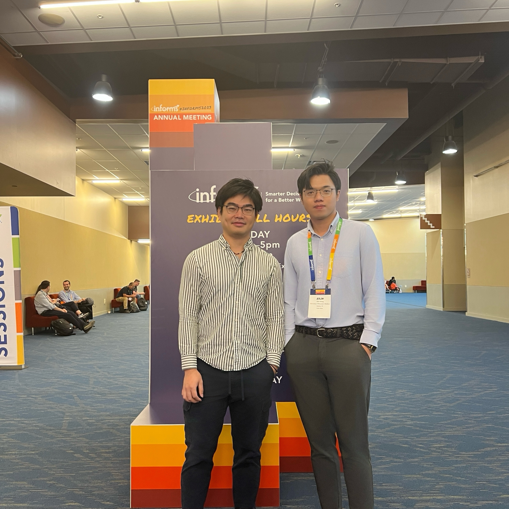
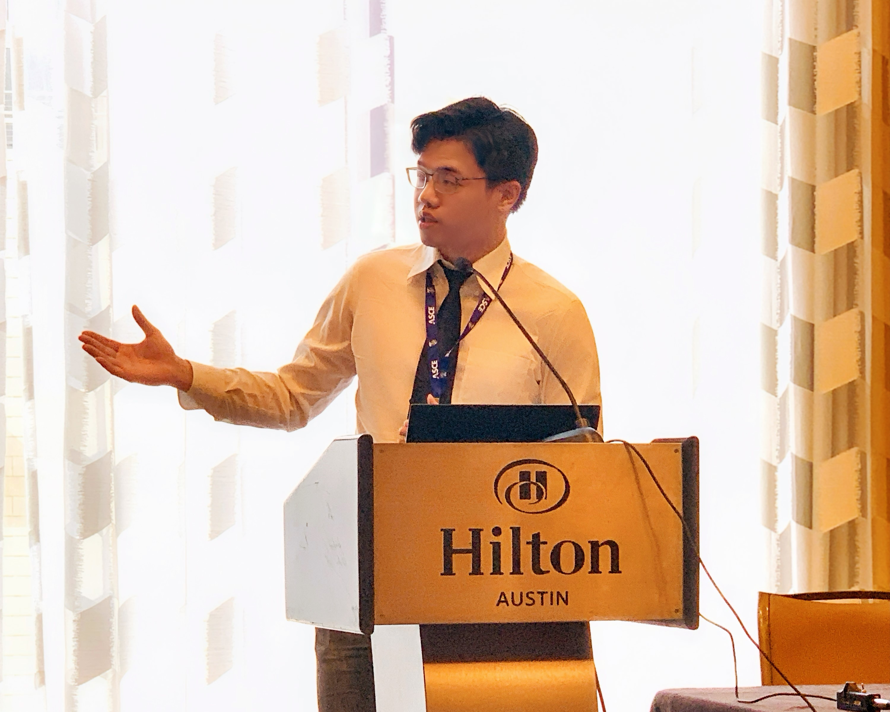
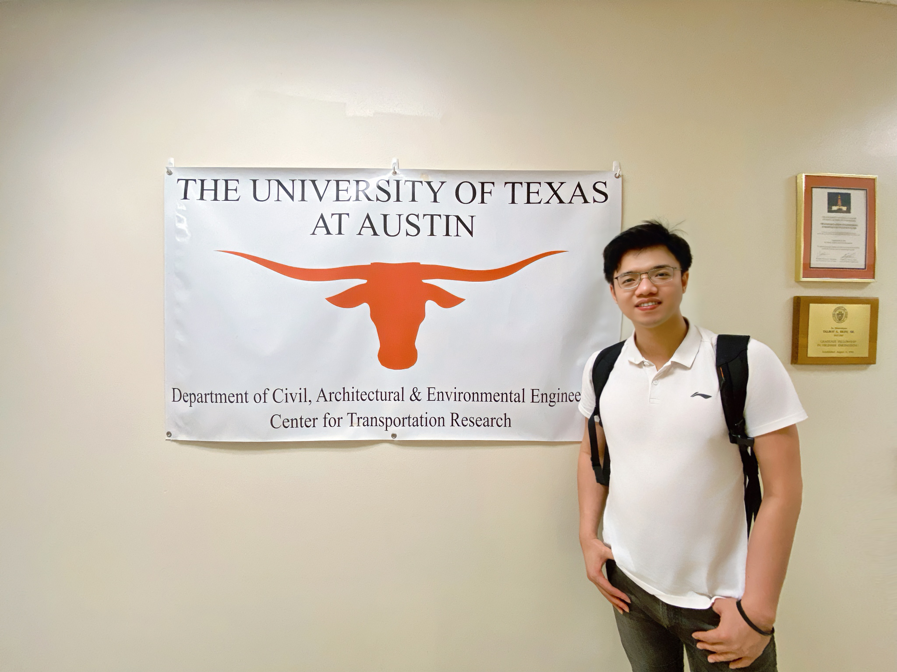
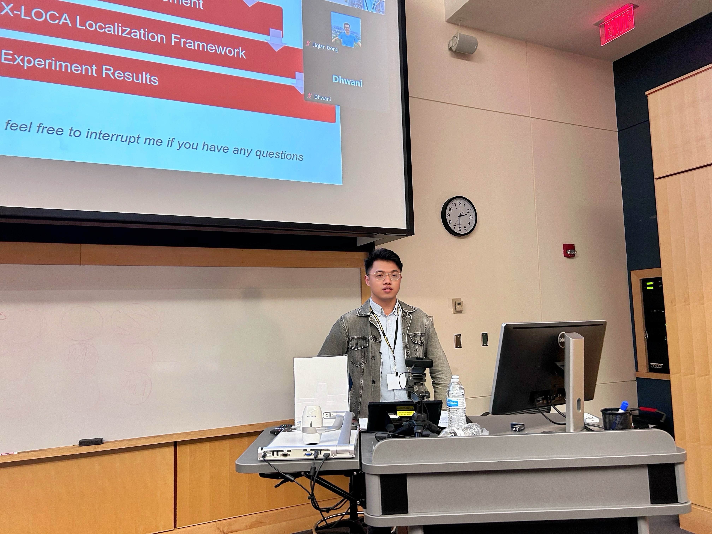
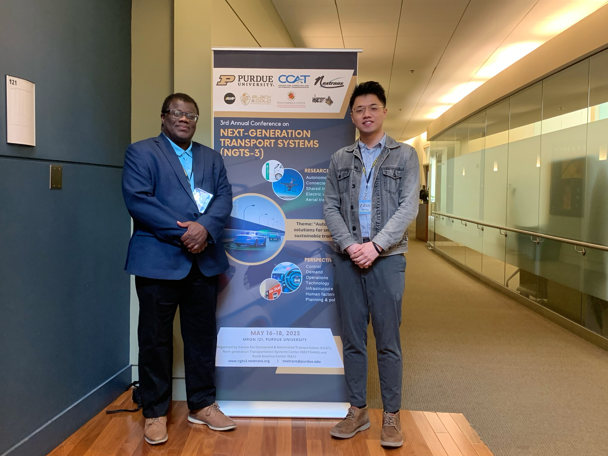
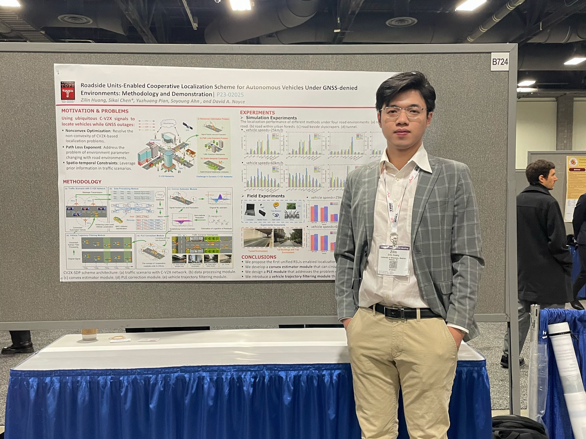
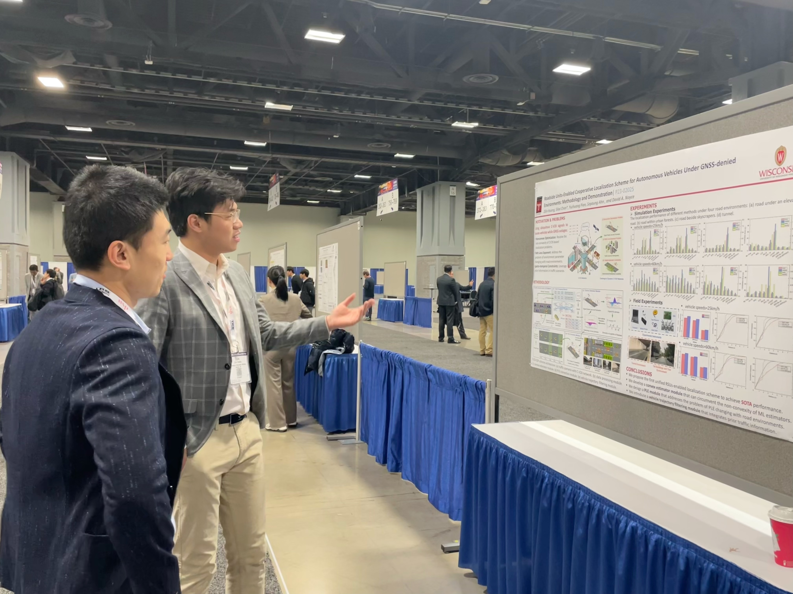

<!-- Year navigation sidebar -->

  <a href="#year-2025">2025</a>
  <a href="#year-2024">2024</a>
  <a href="#year-2023">2023</a>
  <a href="#earlier">Earlier</a>

<h4 style="text-align: left;">Presentations (e.g., Talks/Lectures)</h4>

<h5 id="year-2025" style="text-align: left;">2025</h5>

  

    

      

        <a href="/news/2025/01-12-trb-meeting/" style="color: var(--global-theme-color); text-decoration: none; border-bottom: 1px dashed var(--global-theme-color); transition: all 0.3s ease;">
          Transportation Research Board 104th Annual Meeting <i class="fas fa-external-link-alt" style="font-size: 0.8em; margin-left: 5px;"></i>
        </a>
      

      
January 9, 2025 | Washington, DC, US

      

        <strong>Topic:</strong> V2X-VLM: End-to-end V2X Cooperative Autonomous Driving through Large Vision-Language Models
      

      

        

          

            
            

              TRB Annual Meeting (2025)
            

          

          

            
            

              TRB Annual Meeting (2025)
            

          

        

      

    

    

      
Li Auto Autonomous Driving Team

      
March 14, 2025 | Virtual

      

        <strong>Topic:</strong> VLM-RL: Vision-Language Models for Reinforcement Learning in Autonomous Driving
      

    

  

<h5 id="year-2024" style="text-align: left;">2024</h5>

  

    

      

        <a href="/news/2024/01-12-trb-meeting/" style="color: var(--global-theme-color); text-decoration: none; border-bottom: 1px dashed var(--global-theme-color); transition: all 0.3s ease;">
          Transportation Research Board 103rd Annual Meeting <i class="fas fa-external-link-alt" style="font-size: 0.8em; margin-left: 5px;"></i>
        </a>
      

      
January 10, 2024 | Washington, DC, US

      

        <strong>Topic:</strong> Human as AI mentor: Enhanced human-in-the-loop reinforcement learning for safe and efficient autonomous driving
      

      

        

          

            
            

              TRB Annual Meeting (2024)
            

          

          

            
            

              TRB Annual Meeting (2024)
            

          

        

      

    

    

      
Transportation Alliance Official Account （"交通邦"）

      
February 25, 2024 | Virtual

      

        <strong>Topic:</strong> Human as AI mentor: Enhanced human-in-the-loop reinforcement learning for safe and efficient autonomous driving
      

    

    

      
School of Civil Engineering & Transportation, South China University of Technology

      
April 9, 2024 | Virtual

      

        <strong>Topic:</strong> Human as AI mentor: Enhanced human-in-the-loop reinforcement learning for safe and efficient autonomous driving
      

      
<strong>Invited by:</strong> Prof. Ling Huang

    

  

<h5 id="year-2023" style="text-align: left;">2023</h5>

  

    

      

        <a href="/news/2023/10-19-informs-meeting/" style="color: var(--global-theme-color); text-decoration: none; border-bottom: 1px dashed var(--global-theme-color); transition: all 0.3s ease;">
          INFORMS Annual Meeting (2023) <i class="fas fa-external-link-alt" style="font-size: 0.8em; margin-left: 5px;"></i>
        </a>
      

      
October 19, 2023 | Phoenix, Arizona, US

      

        <strong>Topic:</strong> TFs-DGAN: Multi-View Temporal Factorizations-Based Dynamic Adaptive Generative Adversarial Networks for Hybrid Recovery of Missing Traffic Data
      

      

        

          

            
            

              INFORMS Annual Meeting (2023)
            

          

          

            
            

              INFORMS Annual Meeting (2023)
            

          

        

      

    

    

      

        <a href="/news/2023/06-17-ictd-conference/" style="color: var(--global-theme-color); text-decoration: none; border-bottom: 1px dashed var(--global-theme-color); transition: all 0.3s ease;">
          International Conference on Transportation and Development (ICTD 2023) <i class="fas fa-external-link-alt" style="font-size: 0.8em; margin-left: 5px;"></i>
        </a>
      

      
June 17, 2023 | Austin, Texas, US

      

        <strong>Topic:</strong> Roadside Unit-Enabled Cooperative Localization Framework for Autonomous Vehicles under GNSS-denied Environments
      

      

        

          

            
            

              ICTD Conference (2023)
            

          

          

            
            

              ICTD Conference (2023)
            

          

        

      

    

    

      

        <a href="/news/2023/05-18-ngts-conference/" style="color: var(--global-theme-color); text-decoration: none; border-bottom: 1px dashed var(--global-theme-color); transition: all 0.3s ease;">
          3rd Annual Conference on Next-Generation Transport Systems (NGTS-3) <i class="fas fa-external-link-alt" style="font-size: 0.8em; margin-left: 5px;"></i>
        </a>
      

      
May 18, 2023 | West Lafayette, Indiana, US

      

        <strong>Topic:</strong> Roadside Unit-Enabled Cooperative Localization Framework for Autonomous Vehicles under GNSS-denied Environments
      

      

        

          

            
            

              NGTS-3 Conference (2023)
            

          

          

            
            

              NGTS-3 Conference (2023)
            

          

        

      

    

    

      

        <a href="/news/2023/01-12-trb-meeting/" style="color: var(--global-theme-color); text-decoration: none; border-bottom: 1px dashed var(--global-theme-color); transition: all 0.3s ease;">
          Transportation Research Board 102nd Annual Meeting <i class="fas fa-external-link-alt" style="font-size: 0.8em; margin-left: 5px;"></i>
        </a>
      

      
January 9, 2023 | Washington, DC, US

      

        <strong>Topic:</strong> Roadside Unit-Enabled Cooperative Localization Framework for Autonomous Vehicles under GNSS-denied Environments
      

      

        

          

            
            

              TRB Annual Meeting (2023)
            

          

          

            
            

              TRB Annual Meeting (2023)
            

          

        

      

    

  

<!-- Add JavaScript for active state -->

